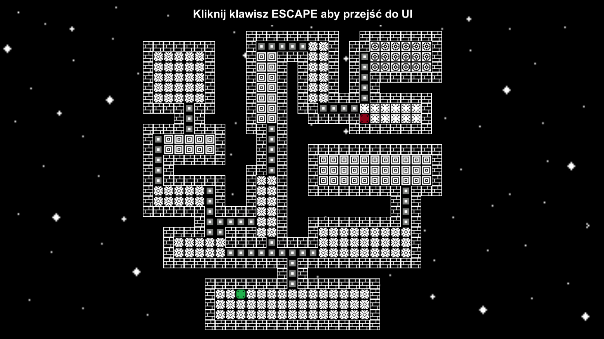

# Roguelike labyrinth generator
## Introduction
Application which use binary space partitioning algorithm to create simple roguelike level.  
It's made in Unity engine with C# language.
## Screenshot
 
